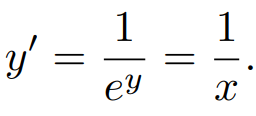

# MathBridge : Enhancing ASR and TTS Models with LLM for Accessible Mathematical Learning in Students with Disabilities

## Abstract
MathBridge is a Automatic Speech Recognition (ASR) and Text to Speech (TTS) pipeline designed for converting mathematical equations to aid students with disabilities. Unlike conventional ASR/TTS systems which cannot translate spoken math into LaTeX or make formula images into spoken math word, MathBridge addresses this gap, enhancing math education for students with hearing/visual impairments. MathBridge utilizes a LLM to transform both spoken and written mathematical content into formats accessible for students with hearing and visual impairments. Previously unattainable, the newly proposed metric, Cosine Character Error Rate (CCER), showcases high accuracy, recorded at 0.114 for ASR pipeline. This signifies that roughly 80% of the equations are accurately communicated. Also, the Real Time Factor (RTF) for the ASR pipeline stands at 11.09, and for the TTS pipeline stands at 17.87. This demonstrates the real-time feasibility of both pipelines.

### This page is for anonymous submission for INTERSPEECH 2024

This page shows the ASR (Automatic Speech Recognition) and TTS (Text-to-Speech) pipelines focused on mathematical content.

---

# ASR Pipeline
This section demonstrates the ASR pipeline using YouTube math lectures.

The following table shows how to convert some of the equations explained in lectures available on YouTube into images.
The YouTube lectures used as examples are from [MIT OpenCourseWare](https://www.youtube.com/@mitocw).

<table border="1">
  <colgroup>
    <col style="width:auto;">
    <col style="width:400px;">
    <col style="width:400px;">
  </colgroup>
  <tr>
    <td></td>
    <td align="center"><b>Lecture Audio</b></td>
    <td align="center"><b>ASR result</b></td>
  </tr>
  <tr>
    <td rowspan="2"><strong>1</strong></td>
    <td>
      <audio controls>
        <source src="audios/example1.wav" type="audio/mpeg">
        Your browser does not support the audio element.
      </audio>
    </td>
    <td>x plus 5y plus 10z equals zero. </td>
  </tr>
  <tr>
    <td align="center"><b>Ours</b></td>
    <td align="center"><b>GPT3.5</b></td>
  </tr>
  <tr>
    <td style="border-bottom: 2px solid black;" rowspan="2">
      Lec 4: Square systems; equations of planes | MIT 18.02 Multivariable Calculus, Fall 2007
      <a href="https://youtu.be/YBajUR3EFSM?t=223" target="_blank">[3:43 ~ 3:48]</a>
    </td>
    <td>$x+5y+10z=0$</td>
    <td>$ x + 5y + 10z = 0 $</td>
  </tr>
  <tr>
    <td style="border-bottom: 2px solid black;"></td>
    <td style="border-bottom: 2px solid black;"></td>
  </tr>
  <tr>
    <td></td>
  </tr>
  <tr>
    <td></td>
    <td align="center"><b>Lecture Audio</b></td>
    <td align="center"><b>ASR result</b></td>
  </tr>
  <tr>
    <td rowspan="2"><strong>2</strong></td>
    <td>
      <audio controls>
        <source src="audios/example2.wav" type="audio/mpeg">
        Your browser does not support the audio element.
      </audio>
    </td>
    <td>h prime of x is equal to d over dx of sine x plus d over dx of square root of 3 times cosine x.</td>
  </tr>
  <tr>
    <td align="center"><b>Ours</b></td>
    <td align="center"><b>GPT3.5</b></td>
  </tr>
  <tr>
    <td style="border-bottom: 2px solid black;" rowspan="2">
      Derivatives of Sine and Cosine | MIT 18.01SC Single Variable Calculus, Fall 2010
      <a href="https://youtu.be/Bb-bgJdOqig?t=88" target="_blank">[01:28 ~ 01:45]</a>
    </td>
    <td>$h^{\prime}(x)={\frac{d}{dx}}\sin x+{\frac{d}{dx}}{\sqrt{3}}\cos x.$</td>
    <td>$h'(x) = \frac{d}{dx}(\sin(x)) + \frac{d}{dx}(\sqrt{3} \cdot \cos(x))$</td>
  </tr>
  <tr>
    <td style="border-bottom: 2px solid black;"></td>
    <td style="border-bottom: 2px solid black;"></td>
  </tr>
  <tr>
    <td></td>
  </tr>
  <tr>
    <td></td>
    <td align="center"><b>Lecture Audio</b></td>
    <td align="center"><b>ASR result</b></td>
  </tr>
  <tr>
    <td rowspan="2"><strong>3</strong></td>
    <td>
      <audio controls>
        <source src="audios/example3.wav" type="audio/mpeg">
        Your browser does not support the audio element.
      </audio>
    </td>
    <td>integral from minus infinity to infinity of e to the minus b squared e to the minus x squared dx.</td>
  </tr>
  <tr>
    <td align="center"><b>Ours</b></td>
    <td align="center"><b>GPT3.5</b></td>
  </tr>
  <tr>
    <td rowspan="2">
      Lec 25 | MIT 18.01 Single Variable Calculus, Fall 2007
      <a href="https://youtu.be/zUEuKrxgHws?t=1815" target="_blank">[30:15 ~ 30:24]</a>
    </td>
    <td>$\int_{-\infty}^{\infty}e^{-b^{2}}e^{-x^{2}}\,dx,$</td>
    <td>$\int_{-\infty}^{\infty} e^{-b^2} e^{-x^2} dx$</td>
  </tr>
  <tr>
    <td></td>
    <td></td>
  </tr>
</table>
 

---

# TTS Pipeline
This section shows the TTS pipeline using images from math textbooks.

The following table shows how to convert the mathematical formulas contained in the paper into speech.

<table border="1">
  <colgroup>
    <col style="width:auto;">
    <col style="width:700px;">
    <col style="width:300px;">
  </colgroup>
  <tr>
    <td></td>
    <td align="center"><b>Formula</b></td>
    <td align="center"><b>OCR result</b></td>
  </tr>
  <tr>
    <td rowspan="2"><strong>1</strong></td>
    <td></td>
    <td>\[y^{\prime}=\frac{1}{e^{y}}=\frac{1}{x}.\] </td>
  </tr>
  <tr>
    <td align="center"><b>Ours</b></td>
    <td align="center"><b>GPT3.5</b></td>
  </tr>
  <tr>
    <td style="border-bottom: 2px solid black;" rowspan="2">
      <a href="https://www.whitman.edu/mathematics/california_calculus/calculus.pdf" target="_blank">[Calculus Math Textbook] Page 98.</a>
    </td>
    <td>y prime equals one over e to the power of y equals one over x.</td>
    <td>y prime equals one over e to the power of y equals one over x.</td>
  </tr>
  <tr>
    <td style="border-bottom: 2px solid black;">
      <audio controls>
        <source src="audios/tts_1_ver2.wav" type="audio/mpeg">
         Your browser does not support the audio element.
      </audio>  
    </td>
    <td style="border-bottom: 2px solid black;">
       <audio controls>
        <source src="audios/tts_1_ver2_GPT.wav" type="audio/mpeg">
         Your browser does not support the audio element.
      </audio>  
    </td>
  </tr>
  <tr>
    <td></td>
  </tr>
  <tr>
    <td></td>
    <td align="center"><b>Formula</b></td>
    <td align="center"><b>OCR result</b></td>
  </tr>
  <tr>
    <td rowspan="2"><strong>2</strong></td>
    <td></td>
    <td>\[\mathrm{Attention}(Q,K,V)=\mathrm{softmax}(\frac{QK^{T}}{\sqrt{d_{k}}})V \] </td>
  </tr>
  <tr>
    <td align="center"><b>Ours</b></td>
    <td align="center"><b>GPT3.5</b></td>
  </tr>
  <tr>
    <td style="border-bottom: 2px solid black;" rowspan="2">
      <a href="https://arxiv.org/pdf/1706.03762.pdf" target="_blank">[Paper "Attention Is All You Need"] Page 4</a>
    </td>
    <td>Attention of Q, K, V equals softmax of the fraction QK transpose over the square root of d sub k times V.</td>
    <td>Attention of Q, K, and V is equal to softmax of Q times K transpose divided by the square root of d sub k, all multiplied by V.</td>
  </tr>
  <tr>
    <td style="border-bottom: 2px solid black;">
      <audio controls>
        <source src="audios/tts2.wav" type="audio/mpeg">
         Your browser does not support the audio element.
      </audio>  
    </td>
    <td style="border-bottom: 2px solid black;">
       <audio controls>
        <source src="audios/tts_2_ver1_GPT.wav" type="audio/mpeg">
         Your browser does not support the audio element.
      </audio>  
    </td>
  </tr>
  <tr>
    <td></td>
  </tr>
  <tr>
    <td></td>
    <td align="center"><b>Formula</b></td>
    <td align="center"><b>OCR result</b></td>
  </tr>
  <tr> 
    <td rowspan="2"><strong>3</strong></td>
    <td></td>
    <td>\[\int_{0}^{2}f(t,t^{2})\sqrt{1+4t^{2}}\,dt=\int_{0}^{2}(t+t^{2})\sqrt{1+4t^{2}}\, dt=\frac{167}{48}\sqrt{17}-\frac{1}{12}-\frac{1}{64}\ln(4+\sqrt{17}).\] </td>
  </tr>
  <tr>
    <td align="center"><b>Ours</b></td>
    <td align="center"><b>GPT3.5</b></td>
  </tr>
  <tr>
    <td rowspan="2">
      <a href="https://www.whitman.edu/mathematics/multivariable/multivariable_16_Vector_Calculus.pdf" target="_blank">[Vector Calculus] Page 4</a>
    </td>
    <td>Integral from 0 to 2 of f of t comma t squared times the square root of 1 plus 4 t squared, d t equals integral from 0 to 2 of t plus t squared times the square root of 1 plus 4 t squared, d t equals 167 over 48 times the square root of 17 minus 1 over 12 minus 1 over 64 times the natural logarithm of 4 plus the square root of 17.</td>
    <td>The integral from 0 to 2 of f of t, t squared, times the square root of 1 plus 4 t squared, with respect to t, is equal to the integral from 0 to 2 of t plus t squared, times the square root of 1 plus 4 t squared, with respect to t, which simplifies to 167 over 48 times the square root of 17, minus 1 over 12, minus 1 over 64 times the natural logarithm of 4 plus the square root of 17.</td>
  <tr>
    <td>
      <audio controls>
        <source src="audios/tts3.wav" type="audio/mpeg">
         Your browser does not support the audio element.
      </audio>  
    </td>
    <td>
       <audio controls>
        <source src="audios/tts_3_ver1_GPT.wav" type="audio/mpeg">
         Your browser does not support the audio element.
      </audio>  
    </td>
  </tr>
  </tr>
</table>

